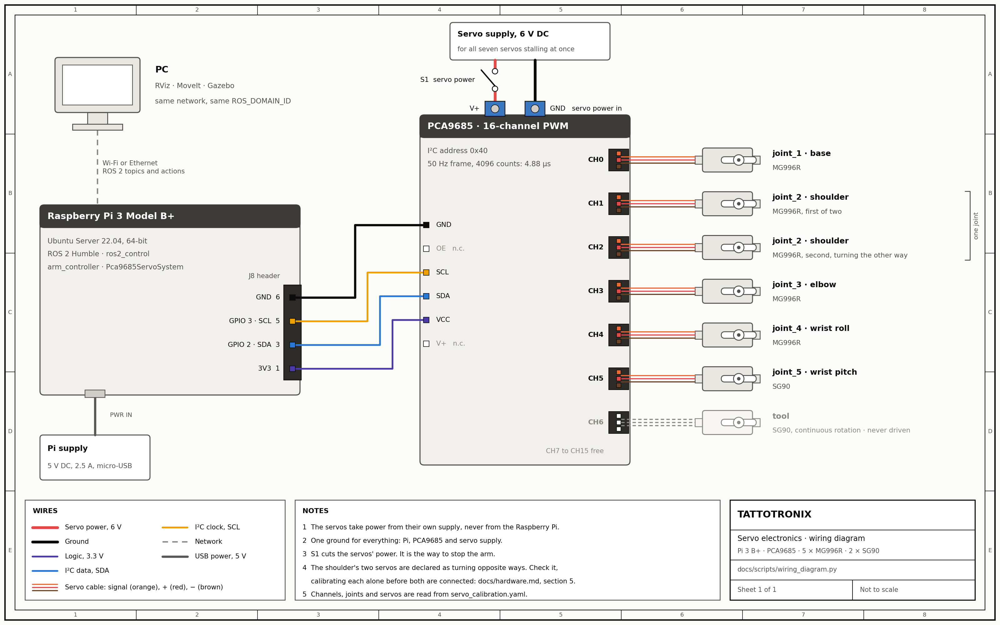

# Running the Real Arm

The simulation and the real arm share everything above the servos: the
description, the controllers, the drawing. This page is the part below them — a
Raspberry Pi, a PCA9685 board, power and a calibration — and how to bring the
arm up on it.

Read [actuators](mathematical-model/actuators.md) first. With the servos the
arm was built with, it draws, but not to a 0.3 mm line: their dead band alone
can put the needle millimetres off it, whatever the controller does.

---

## 1. What runs where

| Machine | Runs | Why there |
|---|---|---|
| **Raspberry Pi 3 Model B+**, or newer | Ubuntu Server 22.04 for 64-bit ARM, ROS 2 Humble `ros-base`, the controller manager, the controllers, the driver and the drawing node, with no display | Little load, and ROS 2 Humble ships binaries for 64-bit ARM |
| **A PCA9685 board** | The pulses for every servo, timed in hardware | A Raspberry Pi has two hardware PWM channels and there are seven servos; pulses timed in software under Linux jitter |
| **A PC on the same network** | RViz, MoveIt, Gazebo | A Pi 3 has 1 GB of memory and no graphics Gazebo can use |

No Arduino is needed. The Pi talks to the PCA9685 over I²C, and the driver in
`tattotronix_hardware` is a `ros2_control` plugin, so the same
`joint_trajectory_controller` that drives the simulation drives the servos.

---

## 2. Wiring

<div align="center">

<br/>
<sub>Drawn by <code>docs/scripts/wiring_diagram.py</code> from
<code>servo_calibration.yaml</code>, the file the driver reads, so it cannot show a
channel the arm does not use. <a href="figures/31_wiring.svg">Vector version, for
printing.</a></sub>
</div>

| PCA9685 | Goes to |
|---|---|
| VCC, logic header | Pi pin 1, 3.3 V: the board's logic |
| GND, logic header | Pi pin 6 |
| SDA, logic header | Pi pin 3, GPIO 2 |
| SCL, logic header | Pi pin 5, GPIO 3 |
| OE and V+, logic header | nothing |
| V+, screw terminal | the servo supply's positive, through its switch |
| GND, screw terminal | the servo supply's negative |

**The servos never take power from the Pi.** They need a supply of their own,
5 to 6 V, that can deliver all of them stalling at once — several amperes for
each large servo, as its catalogue states. The board's grounds are one, so
wiring both of its GNDs joins the Pi's ground to the supply's, which the I²C
signals need.

| Channel | Joint | Servo |
|---|---|---|
| 0 | `joint_1`, base | MG996R |
| 1 | `joint_2`, shoulder | MG996R |
| 2 | `joint_2`, shoulder, the second servo | MG996R, mounted facing the first |
| 3 | `joint_3`, elbow | MG996R |
| 4 | `joint_4`, wrist roll | MG996R |
| 5 | `joint_5`, wrist pitch | SG90 |
| 6 | the tool mount | SG90, continuous rotation — never driven |

The channels are set in
[`servo_calibration.yaml`](../src/tattotronix_description/config/servo_calibration.yaml),
so a board wired differently is a change there, not in code.

---

## 3. The Raspberry Pi

Install Ubuntu Server 22.04 LTS, 64-bit, and ROS 2 Humble's `ros-base` from the
ROS 2 documentation. Then:

```bash
sudo apt install i2c-tools
sudo usermod -aG i2c $USER          # log out and back in
sudo i2cdetect -y 1                 # the board answers at 40
```

If `i2cdetect` shows nothing, the wiring is wrong or I²C is off; on Ubuntu for
Raspberry Pi it is `dtparam=i2c_arm=on` in `/boot/firmware/config.txt`.

Build only what the arm needs. Gazebo and MoveIt stay on the PC, and RViz is
skipped because nothing on the Pi draws a window:

```bash
cd ~/ros2_ws/src && git clone https://github.com/MrDavidAlv/TATTOTRONIX.git
cd ~/ros2_ws
rosdep install --from-paths src/TATTOTRONIX/src/tattotronix_description \
    src/TATTOTRONIX/src/tattotronix_control src/TATTOTRONIX/src/tattotronix_hardware \
    --ignore-src -y --skip-keys "rviz2 joint_state_publisher_gui"
colcon build --packages-up-to tattotronix_hardware --executor sequential
```

On 1 GB of memory a C++ build can run out; if it is killed, add a swap file and
build again.

---

## 4. Before anything moves: a dry run

```bash
ros2 launch tattotronix_hardware arm.launch.py dry_run:=true
```

Everything runs — the description with the calibration, the driver as a plugin,
the controllers — but the board is simulated and nothing is sent. The log says
so. If the controllers come up here, the software side is right, and anything
that goes wrong later is wiring, power or calibration.

The same dry run is part of the test suite: a test in `tattotronix_hardware`
starts this launch file, sends a trajectory the way the drawing node does, and
checks the arm reports it.

---

## 5. Calibration

**The values in `servo_calibration.yaml` are the catalogue convention, not a
measurement**: 1500 µs at mid travel, 636.62 µs per radian. No servo on this arm
has been measured against them. Do this once per servo, and again after one is
remounted.

Calibrate one servo at a time, with only that one connected and its horn off.
`servo_pulse` holds a single channel at a single pulse width, with nothing else
running, and takes new widths as you type them:

```bash
ros2 run tattotronix_hardware servo_pulse 0 1500    # channel 0 at 1500 µs; an empty line stops
```

An empty line switches the channel off before the tool exits. Ctrl-C does not:
it leaves the servo holding the last width it was given.

1. **Zero.** Hold the servo at 1500 µs and fit the horn so its link is at the
   zero pose the URDF defines, as close as the spline allows. Type widths until
   it sits exactly there: that width is `zero_us`.
2. **Direction and scale.** Type `zero_us` plus 318, half a radian at the
   declared scale, and measure the angle the joint turns. Its sign against the
   joint's axis in the URDF is the sign of `us_per_rad`, and 318 over the angle
   in radians is its size.
3. **Limits.** Step the width out each way, a few microseconds at a time, until
   the joint reaches the end of its travel — the servo's, or the printed parts',
   whichever comes first, and at the first sound of the servo straining — and
   set `min_us` and `max_us` a little inside that. The driver never sends a
   pulse outside them.
4. **Check** with the whole arm running: this sends `joint_1` to 0.2 rad over two
   seconds and the others to zero, and each joint should go where it is sent:

   ```bash
   ros2 topic pub --once /arm_controller/joint_trajectory trajectory_msgs/msg/JointTrajectory \
     "{joint_names: [joint_1, joint_2, joint_3, joint_4, joint_5],
       points: [{positions: [0.2, 0.0, 0.0, 0.0, 0.0], time_from_start: {sec: 2}}]}"
   ```

**The shoulder carries two servos on one joint.** Calibrate it with only one of
them connected, then the other alone. The second is declared as mounted facing
the first, so its `us_per_rad_b` is negative. If they are mounted the same way
round that sign is wrong, and connected together they will fight each other at
full stall current.

---

## 6. Running

Put the arm near its zero pose by hand before starting: when the controllers
come up, every servo goes to the pulse for zero at full speed.

```bash
ros2 launch tattotronix_hardware arm.launch.py                          # the arm, holding zero
ros2 launch tattotronix_hardware arm.launch.py draw:=true art:=ros_logo # and the drawing
```

From the PC, on the same network and with the same `ROS_DOMAIN_ID`:

```bash
rviz2                                                    # RobotModel on /robot_description, and TF
ros2 launch tattotronix_moveit_config move_group.launch.py hardware:=pca9685 use_sim_time:=false
```

Stopping the launch with Ctrl-C switches every channel off as the driver shuts
down, and a hobby servo with no pulse stops driving. A process killed outright
runs nothing on its way out: the board keeps sending the last pulses, and the
servo supply's switch is what stops them.

---

## 7. What the arm reports

The driver publishes, as each joint's position, **the position it last sent** —
after the joint limits, the pulse limits and the board's rounding to 4.88 µs —
and as its velocity, the rate that changes at. A hobby servo reports nothing
back. So `/joint_states` from the real arm says where the servos were told to
go, not where they are, and a servo that stalled, slipped or was pushed will
not show in it.

Two things follow from that, and both matter more on the real arm than in the
simulation:

- **"Finished" means "sent".** The trajectory controller checks its tolerances
  against that same echo, so they always hold, and a drawing reported as
  succeeded is one whose every command went out — not one that was drawn as
  planned.
- **The ink trace in RViz is the plan.** The drawing node draws it from the
  planned path, timed against the clock. It shows what the arm was asked to
  draw.

And the arm cannot tell when the needle meets something it did not expect. On a
panel or paper that costs a spoiled drawing; on skin it would be unsafe, and
this setup is not meant for it.

Knowing where the joints are needs servos that report it, such as the bus
servos [actuators](mathematical-model/actuators.md) prices; that would be a
second driver behind the same controllers. The servos already fitted can be
made to report too, by wiring out the potentiometer each one closes its loop on
to an analog-to-digital converter, which is a modification of the servo.

---

## 8. Not done yet

- **The tool-mount servo.** The continuous-rotation SG90 on channel 6 is left
  over from a gripper and is never commanded: the pen must not turn.
- **The calibration.** Declared, not measured, until section 5 is done on the
  real servos.
- **Feedback.** None, for the reason in section 7.
