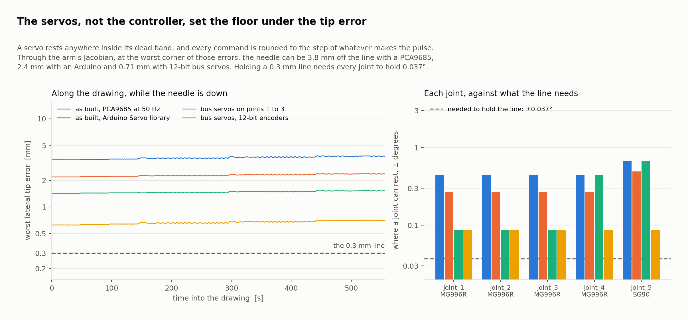

# Actuators

Every other page here asks what a joint loop can achieve. This one asks what the
servos the arm was built with let *any* loop achieve, and the answer is the
largest error term in the project.

---

## 1. What a hobby servo is

[Control](./control.md) studies a joint that takes a torque, closed by a PID at
1 kHz. A hobby servo does not take a torque. It takes a *position*, as the width
of a pulse repeated every 20 ms, and closes its own loop around its own
potentiometer. Nothing outside it can reach into that loop, retune it or read
where the joint actually is. So the loop control.md studies is the loop inside
the servo, which with these parts cannot be changed. What the rest of the
system can do is choose the position to ask for.

Two properties of that arrangement set a floor under the error, and no
controller above the servo can remove either:

- **The dead band.** A change of command narrower than it does not move the
  servo at all. The catalogues give 5 µs for the MG996R and 10 µs for the
  SG90. The servo comes to rest anywhere inside the band, which is centred on
  the command: up to half its width either way.
- **The command step.** Whatever generates the pulse rounds every command. A
  PCA9685 divides its 50 Hz frame into 4096 counts, 4.88 µs each; Arduino's
  `Servo` library takes whole microseconds.

Turning microseconds into angle needs the servo's pulse-to-angle scale, which
neither catalogue states. The usual convention for a 180° servo, 500 to 2500 µs
end to end, is **declared** here: 11.1 µs per degree. It is one line in
`docs/scripts/actuator_study.py`, and the first thing to measure on the real
servos.

## 2. From the joints to the needle

Each joint can come to rest up to $e_i$ from its command, the half-step and the
half-band added. The tip then moves by $\delta p = J_v(q)\,\delta q$, where $J_v$
is the position part of the Jacobian at that pose. Over the box
$|\delta q_i| \le e_i$ the largest error is at one of its 32 corners, because
$|J_v\,\delta q|$ is convex; that is the **worst** figure. If each joint's error
were instead spread evenly over its band and independent of the others, the
root-mean-square error would be $\sqrt{\sum_i |J_{v,i}|^2 e_i^2 / 3}$; its median
over the drawing is the **typical** figure.

Lateral error, in the panel, moves the line. Depth error, along the needle,
changes how far it goes in. Both are evaluated at 3238 poses — every fifth
point of the drawing where the needle is down.

## 3. What it costs at the needle

| Servos, and what drives them | A joint rests within | Worst lateral | Typical lateral | Worst depth |
|---|---|---|---|---|
| As built, PCA9685 at 50 Hz | ±0.445° (MG996R), ±0.670° (SG90) | **3.80 mm** | 1.43 mm | 3.26 mm |
| As built, Arduino `Servo` library | ±0.270° (MG996R), ±0.495° (SG90) | **2.39 mm** | 0.89 mm | 1.99 mm |
| Bus servos on joints 1 to 3, the wrist as built | ±0.088° there, the rest as the first row | **1.54 mm** | 0.59 mm | 0.74 mm |
| Bus servos with 12-bit encoders on every joint | ±0.088° | **0.71 mm** | 0.27 mm | 0.64 mm |

Against a 0.3 mm line, the arm as built can put the needle 12.7 line widths away
with a PCA9685 and 8.0 with an Arduino. The whole difference between the two is
the command step: the PCA9685's 4.88 µs adds almost as much as the MG996R's own
dead band. Neither is close.

Depth is no better. The toolpath drives the needle 1.5 mm below the surface,
and with the servos as built the worst depth error is larger than that: the
needle could stop short of the surface or go in twice as far. A real needle on
these servos would need something that absorbs depth — a spring, or a sensor —
rather than a position the servos can hold.

Bus servos that read their own position with a 12-bit encoder, of the kind
listed as candidates in the development plan, bring the typical error under the
line and the worst case to 2.4 line widths. That assumes one holds its position
to within one encoder count, which depends on a dead-zone setting this model
does not know.

## 4. Which joints matter

How far the needle moves per degree at each joint, at the worst pose of the
drawing:

| Joint | Servo | In the panel | Along the needle |
|---|---|---|---|
| `joint_1`, base | MG996R | 4.97 mm/° | 0.00 mm/° |
| `joint_2`, shoulder | 2 × MG996R | 1.56 mm/° | 4.47 mm/° |
| `joint_3`, elbow | MG996R | 3.64 mm/° | 2.59 mm/° |
| `joint_4`, wrist roll | MG996R | 1.04 mm/° | 0.13 mm/° |
| `joint_5`, wrist pitch | SG90 | 1.29 mm/° | 0.10 mm/° |

The base sets where the line goes, and the shoulder how deep the needle goes;
the elbow does both. The base turns about a vertical axis, so it cannot change
the depth at all.

Those three are the ones worth upgrading first. Bus servos on them alone take
the worst lateral error from 3.80 to 1.54 mm and the worst depth error from
3.26 to 0.74 mm — most of what bus servos on every joint would buy for depth,
and more than half of it for the line. What is left is mostly the wrist: the
SG90 can rest 0.670° either way on a joint that moves the needle 1.29 mm per
degree.

## 5. What the drawing needs

Turned around: one degree of play at every joint, the worst way round, moves the
needle up to **8.09 mm** in the panel. To hold the worst case inside a 0.3 mm
line, every joint must hold **0.037°** either way — about a sixth of the
±0.225° the MG996R's dead band alone allows.

The same figure prices backlash, which no hobby servo catalogue states: every
tenth of a degree of play at every joint costs up to 0.81 mm at the needle,
whatever causes it.

## 6. What this means for building it

- **The computer.** A Raspberry Pi 3 Model B+ can run the arm: Ubuntu Server
  22.04 for 64-bit ARM, ROS 2 Humble's `ros-base`, the controllers and the
  drawing node, with no display. Gazebo, RViz and MoveIt stay on a PC on the
  same network.
- **The pulses.** Seven servos need seven clean pulse trains, and a Raspberry Pi
  has two hardware PWM channels; pulses timed in software under Linux jitter. A
  PCA9685 board generates all seven in hardware, so no Arduino is needed. An
  Arduino works too, and its 1 µs step is the better of the two by a factor of
  1.6 at the needle, but neither brings the error near the line.
- **Power.** The servos need a supply of their own, sized for their stall
  current, never the Pi's 5 V pins, with the grounds joined.
- **Precision.** With these servos the arm can draw, but not to tattoo
  precision. Encoder servos on the base, shoulder and elbow are the first
  change worth making, and the wrist's SG90 the second.

## 7. What is not modelled

- **Backlash and flexure** in the gears and the printed brackets: priced per
  degree above, but not measured.
- **The servo's own loop**: how it moves between commands, overshoot included.
  Only where it can come to rest is modelled.
- **The pulse-to-angle scale**, declared, not measured; every angle on this page
  scales with it.
- **Temperature and supply voltage**, which move both the dead band and the
  torque.

All of it is computed by `docs/scripts/actuator_study.py` from the trajectory the
simulation runs, and written to `docs/data/actuator_study.json`, which the
documents are checked against.
