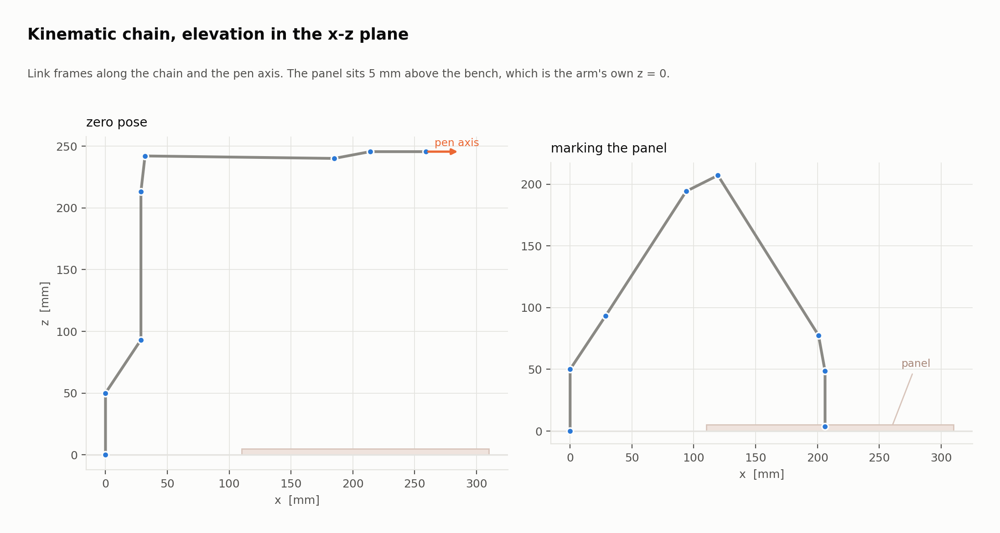
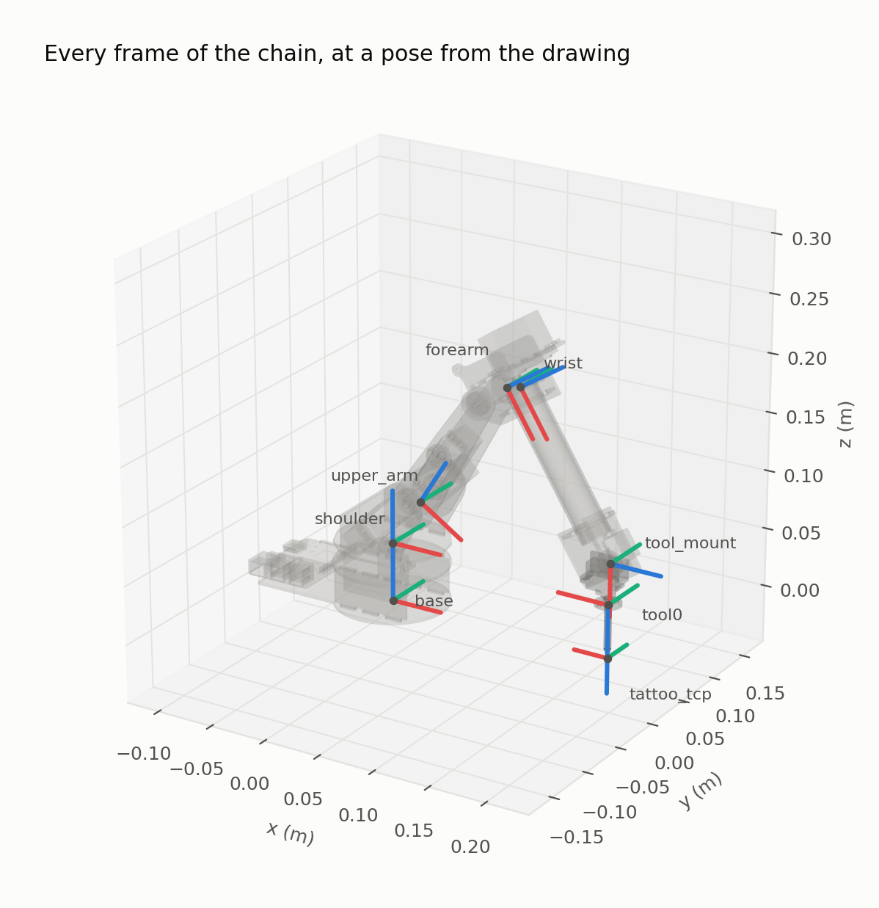
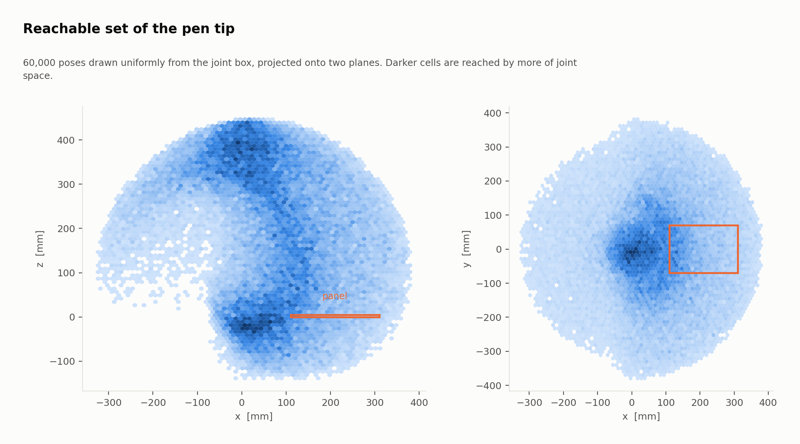
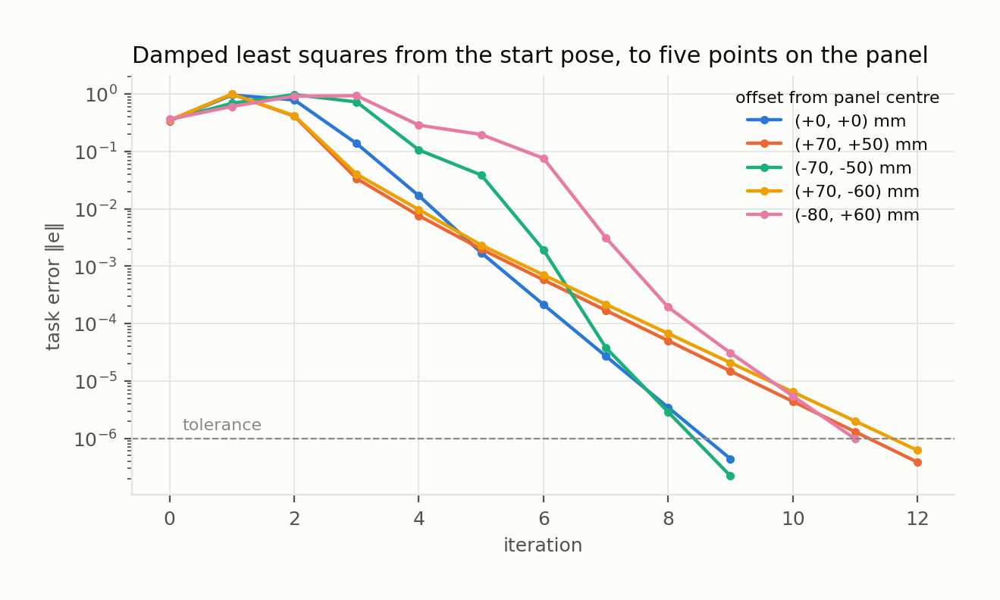
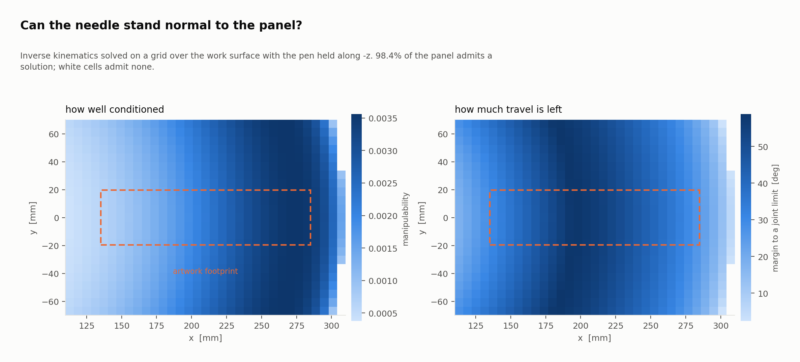
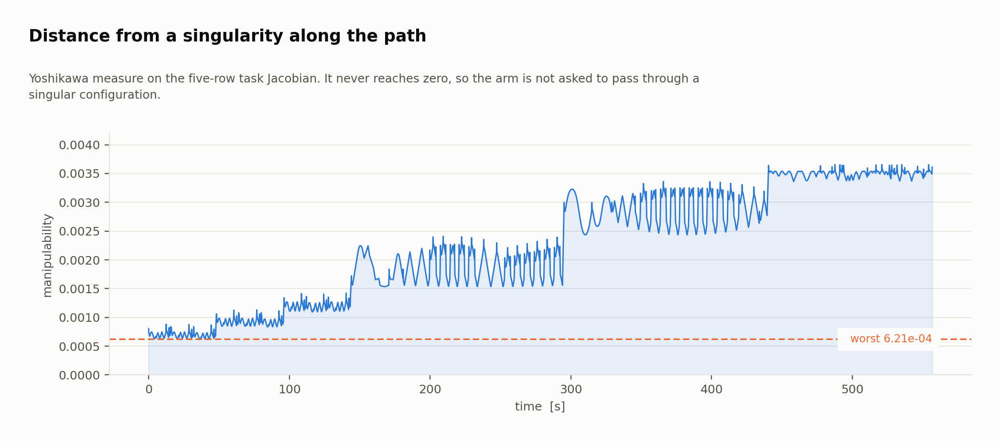
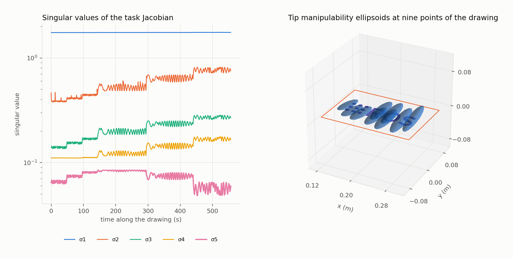
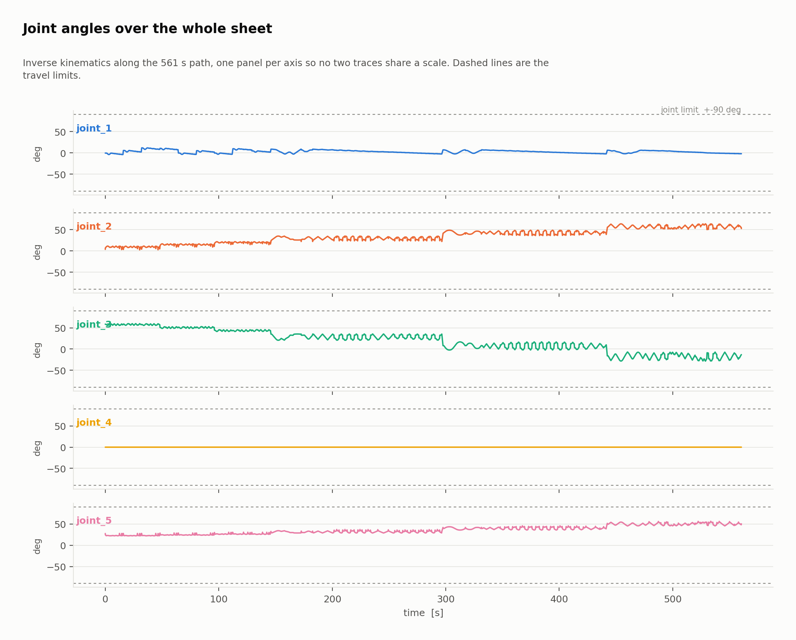

# Kinematics

> Every origin and limit in this document is read from the URDF that `xacro`
> emits. No frame is retyped into a script, so the model cannot disagree with
> the robot `robot_state_publisher` is publishing.
>
> **Worked through step by step, in the browser:** the
> [kinematics notebook](../notebooks/01_kinematics.ipynb)
> 
> derives everything on this page — rotations, homogeneous transforms, the forward
> kinematics symbolically, the product of exponentials, the Jacobians — and checks
> each against the code, and the figures marked *from the notebook* are its output.

## 1. The chain

Five revolute joints and a fixed flange.

| Joint | Parent → Child | Axis | Origin from parent (m) | Limits |
|---|---|---|---|---|
| `joint_1` | `base_link` → `shoulder_link` | Z, yaw | `0, 0, 0.05` | ±1.57 rad |
| `joint_2` | `shoulder_link` → `upper_arm_link` | Y, pitch | `0.02866, -0.00364, 0.0431385` | ±1.57 rad |
| `joint_3` | `upper_arm_link` → `forearm_link` | Y, pitch | `0, 0.0251, 0.1201` | ±1.57 rad |
| `joint_4` | `forearm_link` → `wrist_link` | X, roll | `0.0033, -0.02184, 0.02885` | ±1.57 rad |
| `joint_5` | `wrist_link` → `tool_mount_link` | Y, pitch | `0.153, 0.003, -0.002` | ±1.57 rad |
| fixed | `tool_mount_link` → `tool0` | — | `0.029, -0.012064, 0.005489`, rpy `0, π/2, 0` | — |
| fixed | `tool0` → `tattoo_pen_link` → `tattoo_tcp` | — | `0, 0, 0.045` | — |

 
From the notebook: the frame of every joint and of the needle tip, at a pose from
the drawing; x, y and z in red, green and blue. The tip's z points straight down,
into the work.

### Why there is no Denavit–Hartenberg table

DH asks that each axis be expressed in four parameters relative to the previous
one, which means relocating frames that the exported CAD has already fixed.
That conversion is a translation step that has to be verified, and it breaks the
moment the CAD changes.

Fixed transform followed by axis rotation is exactly as exact, reads directly
alongside the URDF with nothing to translate, and is what `robot_state_publisher`
itself does. There is no accuracy being traded away here, only a convention that
would add a place for the model and the robot to disagree.

## 2. Forward kinematics

Each segment contributes a fixed transform followed, if the joint is actuated, by
a rotation about its axis:

$$T_i(q_i) = T_i^{\text{fixed}} \cdot R(k_i, q_i), \qquad
  T_0^{T}(q) = \prod_{i=1}^{5} T_i(q_i) \cdot T_{\text{flange}} \cdot T_{\text{pen}}$$

with Rodrigues' formula on the unit axis $k$:

$$R(k, q) = I + \sin q \, K + (1 - \cos q) K^2, \qquad K = [k]_\times$$

### Verification

The script's forward kinematics was checked against the live TF tree of the
running system, `robot_state_publisher` loaded with the same URDF. At the zero
pose:

| Frame | Script (mm) | Live TF, as `tf2_echo` prints it (m) |
|---|---|---|
| `tool0` | `213.96, −9.44, 245.58` | `0.214, −0.009, 0.246` |
| `tattoo_tcp` | `258.96, −9.44, 245.58` | `0.259, −0.009, 0.246` |

They agree to the resolution `tf2_echo` prints, which is a millimetre. An
earlier version of this table showed the live column to a hundredth of a
millimetre, a precision the tool never printed. Arm dimensions at the zero pose:
wrist axis at **242 mm**, highest point **292 mm**, flange **214 mm**, tip
**259 mm**.

## 3. Workspace

Uniform sampling of the joint box, projected onto two planes. This is not the
exact reachable volume — uniform sampling in $q$ does not give uniform density in
Cartesian space — but it bounds the envelope and shows where the arm has the most
configurations available. The panel falls inside it, which was the question.

## 4. Why five axes are exactly right

A full pose in space is six constraints and the arm has five joints, so at first
glance one degree of freedom is missing. **For this task it is not.**

Tattooing requires:

- the **tip** at a point on the surface → 3 constraints;
- the **needle axis** along a given direction → 2 constraints, because a
  direction in space is a point on the sphere.

Total: **five**. The sixth parameter of a full pose is rotation *about* the pen
axis, and the needle is a body of revolution: spinning the pen on its own axis
changes nothing about what is drawn.

The arm is therefore exactly sized for the job. This is not a lucky coincidence
to be defended — it is why a five axis manipulator is the right choice here and
not a six axis one with a joint removed.

### The practical consequence

The task Jacobian must be **5×5, not 6×5**. Posed with six rows, the solver
fights permanently over a row no joint combination can satisfy, and the result is
a residual that never falls and a solution biased in the other five. The spin row
is **projected out**:

$$e = \begin{bmatrix} p_{\text{des}} - p(q) \\
      u \cdot (z_{\text{des}} - z(q)) \\
      v \cdot (z_{\text{des}} - z(q)) \end{bmatrix}$$

with $u, v$ a basis of the plane normal to the pen axis. The Jacobian takes the
three linear velocity rows and two combinations of the angular part projected
onto $u$ and $v$.

## 5. Inverse kinematics

Damped least squares — Levenberg–Marquardt on the task Jacobian — warm started
from the previous point of the path:

$$\Delta q = J^{\mathsf T}\left(J J^{\mathsf T} + \lambda I\right)^{-1} e,
\qquad \lambda = 10^{-3}$$

The damping keeps the step bounded near ill-conditioned configurations. Limits
are imposed by saturation: with ±1.57 rad on every axis and the panel well
inside the envelope, saturation firing means the pose is genuinely unreachable,
not that the solver needs help.

 
From the notebook: the solver written out by hand, from the start pose to five
points on the panel, each converging to the same answer as the repository's
<code>chain.ik</code> to 10⁻¹². The error rises on the first step — with damping this
light, the first step overshoots — then falls by a near-constant factor per
iteration. Along the drawing
every solve is warm-started from the previous point and needs about a third as
many.

**Result on the logo:** 100% convergence at all 16656 path points, worst residual
$1.0 \times 10^{-6}$.

## 6. Reachability and where the drawing goes

Can the arm put the needle perpendicular at every point of the panel? Yes, over
**98.4%** of it. The cells that fail are on the outer edge in $x$.

### A correction worth recording

An earlier version of this model said manipulability grows toward $+x$, so the
drawing would be better conditioned about 30 mm further out. **That was wrong**,
and the mistake is easy to repeat: the panel map says what the arm can do *in
each cell*, and says nothing about the extent of a drawing placed on it. A 150 mm
logo already reaches the edge.

Measured along the real path, by the smallest singular value of the task
Jacobian:

| Width × offset | Max reach in $+x$ | $\sigma_5$ | Condition | IK convergence |
|---|---|---|---|---|
| 120 × 0 mm | 60 mm | 0.0590 | 30 | 100% |
| 150 × 0 mm | 75 mm | 0.0483 | 36 | 100% |
| 120 × 15 mm | 75 mm | 0.0484 | 36 | 100% |
| 100 × 30 mm | 80 mm | 0.0441 | 40 | 100% |
| 150 × 15 mm | 90 mm | 0.0332 | 53 | 100% |
| 120 × 30 mm | 90 mm | 0.0333 | 53 | 100% |
| 150 × 30 mm | 105 mm | 0.0055 | 317 | 98% |
| 150 × 45 mm | 120 mm | 0.0056 | 316 | 85% |

$\sigma_5$ and the condition number are taken over the points where inverse
kinematics converged; in the last two rows some did not.

Two different width-and-offset pairs give **the same** $\sigma_5$, to within
0.2%, whenever their maximum reach in $+x$ matches. That is what makes it a law rather
than a coincidence: $\sigma_5$ depends only on how far the arm reaches, and it
**falls** as the drawing moves out.

Manipulability does grow toward $+x$, but it is a *volume*, the product of all
five singular values: the other four grow faster than $\sigma_5$ shrinks.
Optimising the volume while the weakest direction gets worse is backwards for a
damped least squares solver, where $\sigma_5$ is what sets how much joint motion
a unit of tip motion costs.

**The drawing stays centred at 150 mm wide**, the largest size that keeps the
condition number in the thirties on a 200 mm panel.

## 7. Conditioning along the path

 
From the notebook: the five singular values over the whole drawing, and the tip's
manipulability ellipsoid at nine points of it. Each ellipsoid is the image of a unit
ball of joint rates — long where the arm moves the tip easily, thin where it
struggles. The long axis stays within about 4° of the vertical plane through the
base, tilting from mostly radial at the start of the drawing to mostly vertical at
its end: moving in, out, up and down is easy, and sideways — which only
<code>joint_1</code> provides — is not.

| Measure | Value over the logo |
|---|---|
| $\sigma_1$ (largest) | 1.7485 … 1.7573 |
| $\sigma_5$ (smallest) | 0.0483 … 0.0846 |
| Condition number | 21 … 36 |

The arm comes nowhere near a singularity. The extreme of 36 is the right edge of
the **S**, the point of the drawing furthest out in $+x$, which is consistent
with the table above.

The weakest singular direction at that worst point is `joint_2` / `joint_3`
(components -0.48 and +0.81) with some `joint_5` (-0.34): the ordinary
half-extended elbow, not a wrist problem.

### Why `joint_4` sits at zero

`joint_4` is a flat line, and on the real logo it stays flat: over 16656 path
points it never leaves zero by more than 1e-07 rad.

It is not redundant. Its Jacobian column has norm 0.82, comparable to the
others. **Zero is the solution.** `joint_4` is roll about $x$; any non-zero value
would tilt the needle off vertical, which is exactly what the orientation
constraint forbids on a flat horizontal surface.

Put another way: for flat work with a vertical needle the problem is solved with
four axes. `joint_4` earns its place the moment the surface tilts or curves,
which is what real skin does.
